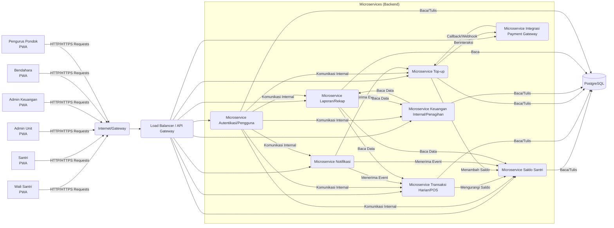
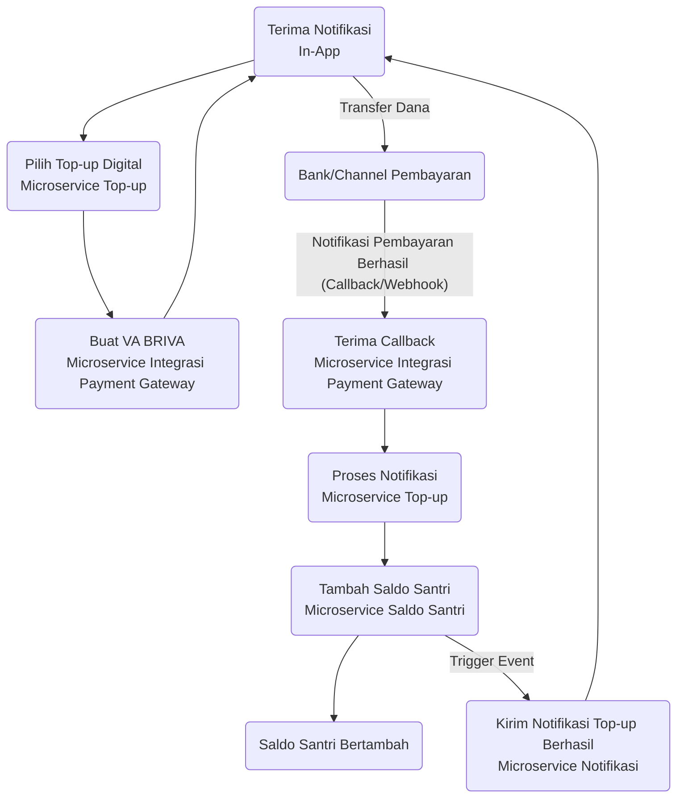
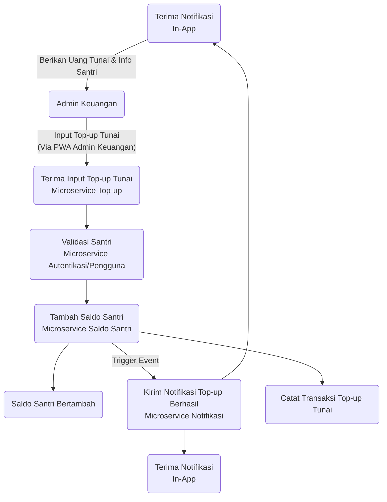
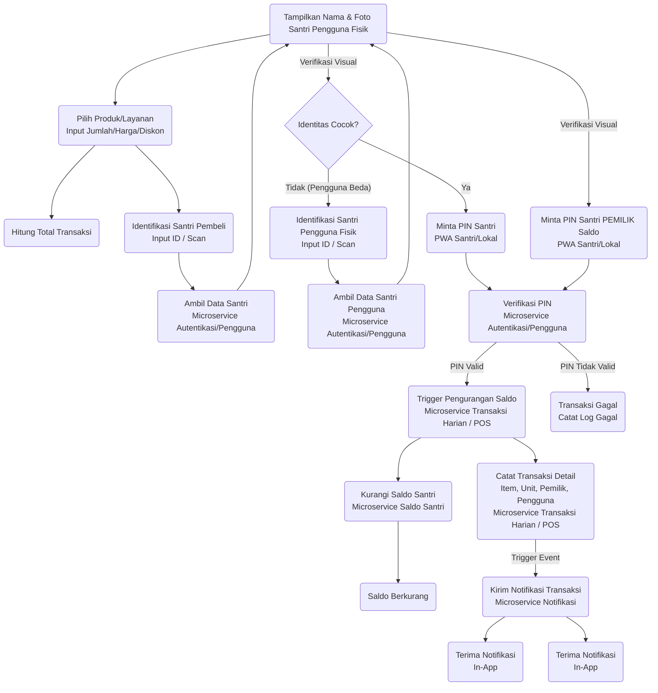
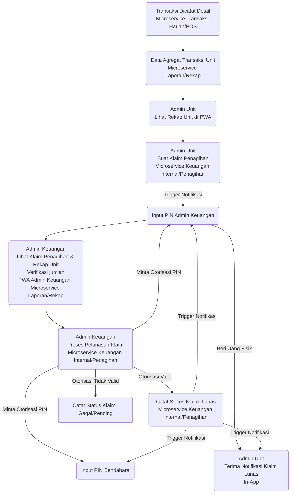
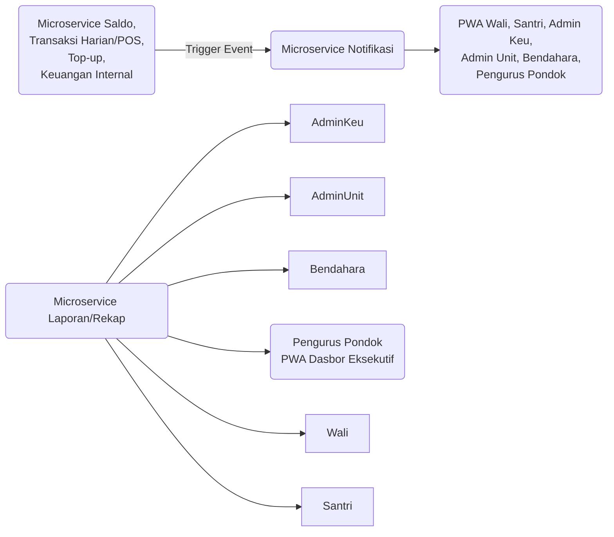

# Dokumen Teknis Pengembangan - Sistem Keuangan Santri (Saku Santri JARINABI)

## 1. Ringkasan Proyek

**Nama Proyek:** Saku Santri JARINABI

**Ringkasan Eksekutif:**

Saku Santri adalah sistem keuangan digital yang dirancang khusus untuk lingkungan pesantren guna mengelola dana saku santri.

Sistem ini akan memfasilitasi proses top-up saldo santri secara digital maupun tunai, pencatatan transaksi harian di unit-unit pondok (seperti kantin, koperasi, laundry) menggunakan antarmuka Point of Sale (POS) sederhana, serta menyediakan pelaporan dan rekap saldo yang akurat dan real-time.

Sistem ini bertujuan meningkatkan transparansi, efisiensi, akuntabilitas, dan keamanan dalam pengelolaan keuangan santri, termasuk formalisasi proses penagihan dan pembayaran antara unit dengan keuangan pusat pondok.

**Tujuan Sistem:**

* Memudahkan kontrol keuangan santri oleh wali melalui akses informasi saldo dan transaksi.

* Mencatat transaksi unit pondok secara digital menggunakan POS sederhana.

* Menjamin akuntabilitas transaksi dan aliran dana dengan otorisasi, log aktivitas, dan alur penagihan/pelunasan formal.

* Menyediakan rekap saldo real-time dan notifikasi penting kepada pengguna.

* Memfasilitasi proses top-up yang mudah melalui berbagai metode.

* Memberikan visibilitas keuangan unit bagi Admin Keuangan dan ringkasan eksekutif bagi Pengurus Pondok.

## 2. Arsitektur Sistem

**Pendekatan Arsitektur:** Microservices

Sistem dibangun menggunakan pendekatan arsitektur microservices, di mana fungsionalitas dipecah menjadi sekumpulan layanan yang kecil, independen, dan dapat di-deploy secara terpisah. **Microservices** ini berkomunikasi satu sama lain melalui API (RESTful API direkomendasikan sebagai awal).

**Manfaat Arsitektur Microservices:**

* **Skalabilitas:** Masing-masing microservice dapat diskalakan secara independen sesuai kebutuhannya.

* **Ketahanan (Resilience):** Kegagalan pada satu microservice tidak langsung mempengaruhi keseluruhan sistem.

* **Fleksibilitas Teknologi:** Memungkinkan penggunaan teknologi (framework, library) yang paling sesuai untuk microservice tertentu (meskipun dalam kasus ini utamanya Python).

* **Kemudahan Pengembangan & Deployment:** Tim developer dapat bekerja dan mendeploy microservice secara independen.

**Diagram Arsitektur (Konseptual Tingkat Tinggi):**

**Komponen Utama (Microservices):**

* **Microservice Autentikasi/Pengguna**
  
  Mengelola data semua peran pengguna, autentikasi (login), otorisasi (hak akses), data santri (nama, foto, PIN), hubungan wali-santri.

* **Microservice Saldo Santri**
  
  Mengelola data saldo santri, menyediakan API untuk penambahan/pengurangan saldo. Ini adalah sumber kebenaran tunggal untuk saldo.

* **Microservice Transaksi Harian / POS**
  
  Mengelola data unit pondok, daftar produk/layanan per unit, menerima input transaksi dari PWA Admin Unit (termasuk harga, diskon), memicu pengurangan saldo via Microservice Saldo Santri, mencatat detail item transaksi.

* **Microservice Top-up**
  
  Mengelola alur top-up, berinteraksi dengan Microservice Integrasi Payment Gateway (untuk BRIVA otomatis) dan menyediakan API untuk pencatatan top-up tunai oleh Admin Keuangan. Memicu penambahan saldo via Microservice Saldo Santri.

* **Microservice Notifikasi**
  
  Menerima event dari microservices lain (saldo berubah, transaksi terjadi, top-up berhasil, status penagihan berubah) dan mengirim notifikasi *in-app* ke PWA pengguna terkait.

* **Microservice Laporan/Rekap**
  
  Menyediakan API untuk mengambil berbagai laporan agregat dan detail dari data yang tersebar di microservices lain (saldo, transaksi, top-up, status penagihan/pelunasan). Digunakan oleh semua peran yang butuh laporan/dashboard.

* **Microservice Keuangan Internal / Penagihan**
  
  Mengelola alur formal penagihan dari Admin Unit ke Admin Keuangan/Bendahara. Merekam klaim penagihan, status pembayaran (pelunasan), dan otorisasi (PIN) untuk proses ini.

* **Microservice Integrasi Payment Gateway**
  
  Bertanggung jawab penuh untuk berkomunikasi dengan API eksternal BRIAPI BRIVA (pembuatan VA, menerima callback notifikasi).

**Database:** PostgreSQL

Setiap microservice *memiliki tanggung jawab utama* atas data tertentu dan berinteraksi dengan skema database yang sesuai. Untuk simplifikasi awal, bisa menggunakan satu instance PostgreSQL dengan *schema terpisah* untuk setiap microservice atau kelompok microservice yang terkait erat. Data sensitif (seperti PIN, kredensial API) harus dienkripsi dengan aman.

## 3. Teknologi Stack

* **Backend:** Python 3.x. Framework **FastAPI** direkomendasikan untuk membangun API microservices yang ringan, cepat, dan modern. Penggunaan library seperti SQLAlchemy untuk ORM.

* **Database:** PostgreSQL. Sistem manajemen database relasional yang powerful dan handal.

* **Frontend:** Progressive Web Application (PWA). Dibangun menggunakan framework JavaScript modern seperti **React, Vue.js, atau Angular**. Dipilih untuk dukungan multiplatform (desktop & mobile browser) dan fitur PWA (offline support terbatas, add to home screen).

* **Payment Gateway:** BRIAPI dengan BRIVA Web Service untuk fasilitas top-up Virtual Account otomatis.

* **Containerization:** Docker. Digunakan untuk membuat image kontainer untuk setiap microservice backend, frontend PWA (disajikan via web server ringan), dan database.

* **Orkestrasi (Opsional Awal):** Docker Compose untuk pengembangan dan staging lokal multi-kontainer. Kubernetes dapat dipertimbangkan untuk skala produksi yang lebih besar di masa depan.

* **Deployment:** Digital Ocean Droplets (Ubuntu Server).

## 4. Peran Pengguna dan Fungsi

| Peran              | Deskripsi                                                                                                   | Fungsi Utama                                                                                                                                                              | Antarmuka PWA                                   |
|--------------------|-------------------------------------------------------------------------------------------------------------|-----------------------------------------------------------------------------------------------------------------------------------------------------------------------------|-------------------------------------------------|
| Wali Santri        | Orang tua/wali santri.                                                                                      | Top-up saldo santri (digital/tunai), lihat saldo & riwayat transaksi santri (termasuk detail item dari POS), terima notifikasi, **mengelola beberapa santri**, **mengatur budgeting/aturan pengeluaran** (fitur dasar). | PWA Wali Santri                                 |
| Santri             | Pelajar di pesantren.                                                                                       | PIN otorisasi transaksi harian, lihat saldo & riwayat transaksi diri (detail item), terima notifikasi.                                                                      | PWA Santri                                      |
| Admin Keuangan     | Petugas keuangan pondok, mengelola keuangan pusat dan kas fisik.                                            | Verifikasi & catat top-up tunai, lihat semua transaksi santri (detail item), monitoring umum, **melihat rekap transaksi unit untuk verifikasi pelunasan fisik**, **mencatat pelunasan tagihan unit** (dengan otorisasi PIN). | PWA Admin Keuangan                              |
| Admin Unit         | Petugas di unit pondok (Kantin Putra/Putri, Koperasi, dll.).                                | Input transaksi harian menggunakan antarmuka **POS sederhana** (termasuk ubah harga/diskon), **verifikasi identitas santri saat transaksi**, lihat rekap transaksi unit sendiri, **menggunakan rekap sistem sebagai dasar penagihan uang fisik** ke Admin Keuangan (dengan otorisasi PIN). | PWA Admin Unit (dengan fungsionalitas POS)      |
| Bendahara Pondok   | Petugas dengan otoritas tertinggi di bidang keuangan.                                                       | 
- **Otorisasi ganda** pelunasan tagihan unit (dengan PIN Admin Keuangan & Bendahara)
- **Monitoring** keuangan global via dashboard interaktif
- **Notifikasi real-time** untuk klaim menunggu
- **Audit log** dengan fitur pencarian dan filter
- **Detail klaim** dengan rekap transaksi per item | PWA Bendahara (dengan fitur otorisasi ganda, notifikasi, dan audit log) |
| Pengurus Pondok    | Pimpinan/pengambil keputusan di pondok.                                                                     | Melihat **Dasbor Eksekutif** yang menampilkan ringkasan finansial pondok.                                                                                                  | PWA Pengurus Pondok (hanya tampilan dashboard) |

## 5. Alur Kerja Inti

### 5.1. Alur: Top-up Saldo

Ada dua jenis alur top-up:

**5.1.1. Alur Top-up Digital (BRIAPI BRIVA - Otomatis):**

**5.1.2. Alur Top-up Tunai (via Admin Keuangan):**

### 5.2. Alur: Transaksi Harian Menggunakan POS Sederhana

### 5.3. Alur: Pelaporan Transaksi Unit & Penagihan/Pelunasan Formal

### 5.4. Alur: Monitoring & Notifikasi

## 6. Fitur Dasar (Scope Proyek Awal)

* Manajemen Akun Pengguna (Semua Peran)

* Login & Otorisasi Berbasis Peran

* **Fitur Wali Santri:**

  * Lihat Saldo & Riwayat Transaksi Santri (termasuk detail item dari POS)

  * Top-up Saldo (Digital BRIVA Otomatis & Tunai via Admin Keu)

  * Notifikasi In-App

  * **Mengelola Multi-Santri dalam Satu Akun Wali**

  * **Mengatur Budgeting Harian/Mingguan Santri**

  * **Menetapkan Aturan Pengeluaran Khusus (misal, blokir unit tertentu)**

  * **Mengatur Limit Pengeluaran Harian per Unit** - Wali dapat menetapkan batas maksimal pengeluaran santri per hari untuk unit tertentu (kantin/koperasi)

* **Fitur Santri:**

  * Lihat Saldo & Riwayat Transaksi Diri (termasuk detail item)

  * PIN Otorisasi Transaksi

  * Notifikasi In-App

  * Peringatan saat transaksi melebihi limit yang ditetapkan wali

* **Fitur Admin Unit:**

  * Antarmuka **POS Sederhana** (Input transaksi, pilih produk/layanan, **ubah harga & diskon**, hitung total)

  * **Verifikasi Identitas Santri (dengan nama & foto)** saat transaksi

  * Lihat Rekap Transaksi Harian/Periode di Unitnya dengan breakdown per item

  * **Mulai Proses Penagihan Uang Fisik** berdasarkan rekap sistem (dengan otorisasi PIN Admin Unit)

  * **Proses Penagihan dan Pelunasan** dengan modal konfirmasi dan input PIN

  * Notifikasi In-App

* **Fitur Admin Keuangan:**

  * Verifikasi & Catat Top-up Tunai

  * Lihat Semua Transaksi Santri (dengan detail item)

  * Monitoring Saldo Semua Santri

  * Lihat Rekap Transaksi Semua Unit (untuk verifikasi penagihan)

  * **Menerima & Memproses Pelunasan Tagihan Unit (dengan Otorisasi PIN Admin Keu & Bendahara)**

  * Notifikasi In-App

* **Fitur Bendahara Pondok:**

  * **Otorisasi Pelunasan Tagihan Unit (dengan Otorisasi PIN Bendahara & Admin Keu)**

  * Akses Laporan & Rekap Global (via Microservice Laporan)

  * Notifikasi In-App

* **Fitur Pengurus Pondok:**

  * **Dasbor Eksekutif:** Ringkasan finansial pondok (total saldo santri, total transaksi per periode, rekap top-up, status penagihan/pelunasan unit, dll.).

* **Fitur Inti Sistem:**

  * Pencatatan Transaksi Detail (termasuk item, unit, santri pemilik, santri pengguna fisik jika beda)

  * Log Aktivitas (Audit Log)

  * Otorisasi PIN untuk Transaksi Santri & Alur Keuangan Internal

  * Integrasi Otomatis BRIAPI BRIVA (Create VA, Callback)

  * **Sistem Formal Pencatatan Penagihan Unit & Pelunasan oleh Keuangan Pusat (dengan Otorisasi PIN Ganda)**

  * Notifikasi In-App Only

## 7. Detail Implementasi Teknis

### 7.1. Backend (Python - FastAPI)

* Setiap **microservice** akan menjadi aplikasi FastAPI terpisah yang berjalan dalam kontainer Docker.

* Komunikasi antar **microservices** melalui API RESTful internal. Pertimbangkan otentikasi/otorisasi antar microservice (misal, menggunakan API Key internal atau JWT ter scoped).

* Penggunaan ORM SQLAlchemy untuk interaksi database.

* Error Handling dan Logging yang konsisten di semua microservice.

* **Microservice Autentikasi/Pengguna:** Endpoint untuk login, registrasi (oleh admin), manajemen peran, CRUD data pengguna/santri/wali, penyimpanan hash PIN, API untuk validasi PIN, API untuk mengambil data santri (nama, foto) berdasarkan ID.

* **Microservice Saldo Santri:** Endpoint untuk menambah/mengurangi saldo berdasarkan permintaan yang terotorisasi dari Microservice Top-up atau Transaksi Harian/POS. Log mutasi saldo detail.

* **Microservice Transaksi Harian / POS:** Endpoint untuk: mengelola data unit dan produk/layanan (CRUD sederhana, mungkin diatur oleh Admin Keu via PWA atau langsung di DB awal), menerima data transaksi dari PWA Admin Unit (termasuk detail item, harga, diskon), memicu validasi PIN via Microservice Autentikasi, memicu pengurangan saldo via Microservice Saldo Santri. Mencatat detail transaksi lengkap di databasenya.

* **Microservice Top-up:** Endpoint publik untuk menerima callback dari BRIAPI (memerlukan validasi signature/keamanan dari BRIAPI). Endpoint internal untuk mencatat top-up tunai oleh Admin Keuangan (membutuhkan data santri dan jumlah). Memanggil Microservice Saldo Santri untuk menambah saldo.

* **Microservice Notifikasi:** Endpoint internal untuk menerima event (webhook) dari microservices lain saat terjadi perubahan status penting. Mengelola pengiriman notifikasi in-app ke pengguna terkait melalui mekanisme PWA Push Notifications (membutuhkan integrasi dengan service push notif).

* **Microservice Laporan/Rekap:** Endpoint untuk query data agregat dan detail dari database microservices lain (via API internal atau akses baca langsung jika database sama). Logic untuk membuat laporan rekap unit (harian/periode), laporan saldo santri, riwayat transaksi detail, data dashboard eksekutif (total saldo, total transaksi periode, status penagihan unit).

* **Microservice Keuangan Internal / Penagihan:** Endpoint untuk: Admin Unit mengajukan klaim penagihan (berdasarkan periode, unit, dan nominal dari laporan rekap), Admin Keuangan/Bendahara melihat klaim, Admin Keuangan/Bendahara mengotorisasi (membutuhkan validasi PIN ganda dari keduanya) dan mencatat status pelunasan. Mencatat status klaim penagihan/pelunasan, log otorisasi PIN.

* **Microservice Integrasi Payment Gateway:** Endpoint publik untuk menerima callback BRIAPI. Logic internal untuk membuat permintaan ke API BRIAPI (Create VA, dll.) dan validasi respons/callback.

### 7.2. Database (PostgreSQL)

* Satu instance PostgreSQL awal dengan skema database logis untuk setiap microservice, atau database terpisah jika arsitektur menghendaki isolasi data yang lebih ketat.

* Tabel-tabel penting (contoh):

  * `users` (Microservice Autentikasi/Pengguna) - semua peran, hash PIN, foto path, relasi wali-santri.

  * `santri_balances` (Microservice Saldo Santri) - saldo santri.

  * `balance_mutations` (Microservice Saldo Santri) - log mutasi saldo.

  * `units` (Microservice Transaksi Harian/POS) - daftar unit (Kantin Putra, dll.).

  * `products` (Microservice Transaksi Harian/POS) - daftar produk/layanan per unit, harga.

  * `transactions` (Microservice Transaksi Harian/POS) - detail transaksi utama (waktu, total, unit, santri pemilik, santri pengguna, status).

  * `transaction_items` (Microservice Transaksi Harian/POS) - detail item (produk_id, nama item, harga saat transaksi, jumlah) dalam setiap transaksi.

  * `topup_requests` (Microservice Top-up) - log permintaan top-up (jenis, nominal, status, kode VA, tanggal/waktu).

  * `audit_logs` (Microservice Autentikasi/Pengguna atau Log Service Terpisah) - log semua aktivitas penting.

  * `billing_claims` (Microservice Keuangan Internal/Penagihan) - data klaim penagihan unit (periode start, periode end, unit_id, jumlah_klaim, status (diajukan, lunas, dibatalkan), tanggal pengajuan, tanggal pelunasan).

  * `billing_authorizations` (Microservice Keuangan Internal/Penagihan) - log otorisasi PIN untuk klaim (klaim_id, user_id, role, timestamp, status otorisasi).

  * `notifications` (Microservice Notifikasi) - daftar notifikasi untuk setiap pengguna.

  * `santri_budgeting` (Microservice Autentikasi/Pengguna atau Saldo Santri) - aturan budgeting per santri.

  * `santri_spending_rules` (Microservice Autentikasi/Pengguna atau Transaksi Harian/POS) - aturan pengeluaran per santri (blokir unit/produk).

* Penggunaan tool Migrations (misal Alembic) untuk mengelola perubahan skema database secara terstruktur.

### 7.3. Frontend (PWA - React/Vue/Angular)

* Mengembangkan single-page application (SPA) yang dapat diinstal sebagai PWA.

* Menggunakan API dari microservices backend untuk semua operasi data.

* Antarmuka pengguna yang spesifik untuk setiap peran (Wali, Santri, Admin Unit POS, Admin Keuangan, Bendahara, Pengurus Pondok).

* Implementasi fitur PWA: Web App Manifest (untuk instalasi), Service Worker (untuk caching aset, fungsionalitas offline dasar jika diperlukan, Push Notifications).

* Antarmuka Admin Unit POS: Tampilan daftar produk (dari backend), antarmuka "keranjang" transaksi, perhitungan subtotal/total, input/scanner santri ID, **tampilan nama/foto santri untuk verifikasi**, input nominal/diskon/ubah harga, tombol otorisasi PIN. Antarmuka untuk melihat rekap transaksi unit dan **memulai proses penagihan**.

* Antarmuka Admin Keuangan: Tampilan laporan rekap unit (semua unit) untuk verifikasi penagihan, antarmuka untuk melihat klaim penagihan dari unit, antarmuka untuk **memproses pelunasan klaim (membutuhkan input PIN Admin Keu)**, input data top-up tunai.

* Antarmuka Bendahara: Antarmuka **otorisasi PIN Bendahara** untuk persetujuan pelunasan klaim.

* Antarmuka Pengurus Pondok: Tampilan **Dasbor Eksekutif** (hanya baca).

* Antarmuka Wali Santri: Tampilan saldo, riwayat transaksi detail, fitur top-up (digital & tunai), **antarmuka manajemen multi-santri**, **antarmuka pengaturan budgeting dan aturan pengeluaran**.

* Antarmuka Santri: Tampilan saldo, riwayat transaksi detail, antarmuka input PIN saat otorisasi.

* Implementasi Push Notifications di PWA untuk notifikasi real-time dari Microservice Notifikasi.

### 7.4. Integrasi Eksternal

* **BRIAPI BRIVA**
  
  Implementasi di **Microservice Integrasi Payment Gateway**. Membutuhkan registrasi dan kredensial dari BRI. Mengikuti dokumentasi API BRIAPI untuk Create VA dan Callback Notifikasi Pembayaran. Keamanan callback (signature validation) sangat penting.

* **Layanan Push Notification**
  
  Membutuhkan integrasi dengan layanan push notification untuk PWA (misal, Firebase Cloud Messaging/FCM atau layanan lain) yang akan digunakan oleh Microservice Notifikasi.

### 7.5. Containerization (Docker)

* Dockerfile untuk setiap microservice backend, web server (Nginx/Caddy) untuk menyajikan frontend PWA, dan kontainer PostgreSQL.

* Docker Compose untuk orkestrasi lingkungan development/staging multi-kontainer. Mendefinisikan jaringan, volume, dan dependensi antar kontainer.

* Menggunakan variabel lingkungan untuk konfigurasi kontainer (kredensial database, endpoint API internal, kredensial BRIAPI, kunci untuk layanan push notification).

### 7.6. Deployment (Digital Ocean Ubuntu)

* Menyiapkan Droplets Ubuntu.

* Menginstal Docker dan Docker Compose.

* Strategi Deployment: Build image Docker -> Push ke Registry (Docker Hub, DO Registry) -> Pull di server -> Jalankan dengan Docker Compose.

* Menggunakan Reverse Proxy (Nginx/Caddy) di depan kontainer PWA dan API Gateway (jika digunakan) untuk SSL termination (HTTPS) dan routing traffic.
  
* Konfigurasi Firewall (UFW atau DO Firewall) untuk membatasi akses hanya pada port yang diperlukan (HTTPS, mungkin port internal antar droplet jika microservices dipisah).

* Menyiapkan Volume Docker untuk data persisten PostgreSQL.

* Menerapkan monitoring dan logging untuk kontainer (misal, menggunakan solusi logging terpusat atau integrasi DO Monitoring).

## 8. Pertimbangan Keamanan

* **Otentikasi & Otorisasi:** Token-based authentication (JWT atau OAuth 2.0) untuk akses API. Otorisasi granular berbasis peran di setiap microservice.

* **Keamanan PIN Santri & Admin/Bendahara:** PIN tidak disimpan dalam format plain text, gunakan hashing (misal, Argon2, bcrypt). Validasi PIN dilakukan di backend. Implementasi "salt" yang unik per PIN.

* **Otorisasi PIN Ganda:** Implementasi yang ketat untuk alur transaksi santri (PIN santri) dan alur keuangan internal (PIN Admin Keu & Bendahara) untuk otorisasi kritis.

* **Audit Log:** Pencatatan mendetail atas semua aktivitas penting, terutama transaksi (termasuk detail item, siapa Admin Unit, siapa santri pemilik, siapa santri pengguna), top-up, perubahan saldo, klaim penagihan, dan proses pelunasan (siapa yang mengajukan, siapa yang mengotorisasi PIN).

* **Keamanan API:** Penggunaan HTTPS wajib. Validasi input data di sisi server. Rate limiting untuk endpoint tertentu.

* **Keamanan BRIAPI:** Menjaga kerahasiaan kredensial BRIAPI. Menggunakan IP Whitelisting jika didukung. Validasi signature/mekanisme keamanan callback dari BRIAPI.

* **Keamanan Server:** Update OS rutin, konfigurasi firewall, penggunaan SSH key, tidak menjalankan layanan dengan hak akses root.

* **Verifikasi Identitas Visual:** Langkah konfirmasi nama & foto santri oleh Admin Unit menambah lapisan keamanan dalam transaksi fisik di unit.

## 9. Pengembangan Lanjutan (Future Enhancements)

Ini adalah fitur yang *tidak termasuk* dalam lingkup proyek awal tetapi dapat dipertimbangkan di masa depan:

* Integrasi notifikasi via WhatsApp dan Email (saat ini hanya in-app).

* Fitur penarikan saldo (jika relevan dan disetujui kebijakan pondok).

* Modul ZIS (Zakat, Infaq, Sedekah) jika diperlukan.

* Manajemen inventori yang lebih canggih terkait POS.

* Integrasi dengan Sistem Informasi Santri (SIS) pesantren untuk sinkronisasi data santri.

* Integrasi dengan Payment Gateway/API bank lain untuk top-up.

* Dukungan multi-bahasa (jika pesantren memiliki santri/wali internasional).

* Peningkatan fungsionalitas offline PWA (misal, bisa mencatat transaksi saat offline dan sync saat online).

* Integrasi dengan sistem pihak ketiga melalui API publik/private.

* Implementasi otentikasi biometrik untuk santri.

* Dukungan multi-tenancy untuk pesantren yang berbeda.

* Fitur manajemen pengguna/unit yang lebih dinamis (misal, Admin Keuangan bisa menambah/mengedit data unit dan user Admin Unit).
