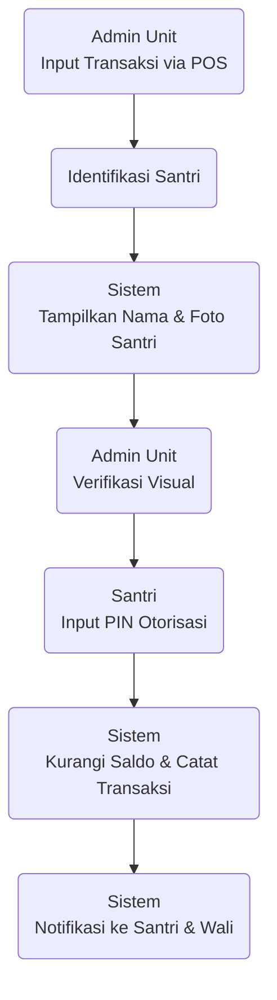
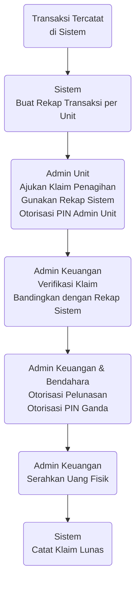
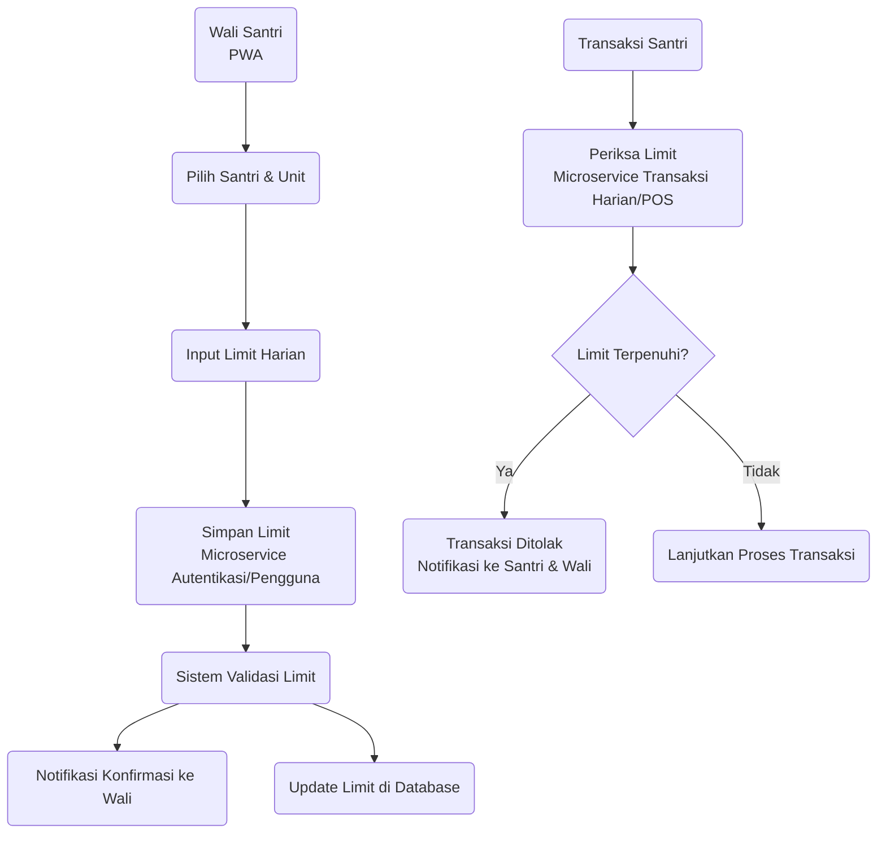

# Executive Brief - Sistem Keuangan Santri Digital (Saku Santri JARINABI)

## Ringkasan Eksekutif

Saku Santri JARINABI adalah solusi keuangan digital modern yang dirancang khusus untuk lingkungan pesantren. Sistem ini menyediakan platform terintegrasi untuk pengelolaan dana saku santri secara efisien, transparan, dan aman.

Dengan memfasilitasi top-up saldo digital, transaksi harian di unit-unit pondok melalui antarmuka Point of Sale (POS) sederhana, serta pelaporan dan rekonsiliasi keuangan yang terstruktur, Saku Santri bertujuan untuk meningkatkan akuntabilitas seluruh ekosistem keuangan pesantren terkait santri.

## Tujuan Strategis Sistem

* **Peningkatan Akuntabilitas**
  
  Memastikan setiap rupiah dana santri tercatat dan dapat dilacak.

* **Efisiensi Operasional**
  
  Menyederhanakan proses top-up, transaksi, dan rekonsiliasi bagi seluruh pihak terlibat.

* **Transparansi Informasi**
  
  Menyajikan data saldo dan transaksi yang akurat dan real-time kepada wali dan santri.

* **Penguatan Keamanan**
  
  Melindungi dana santri melalui mekanisme otorisasi yang kuat dan audit trail yang komprehensif.

* **Pengambilan Keputusan Berbasis Data**
  
  Menyediakan rekap dan ringkasan keuangan untuk manajemen pondok.

## Pengguna Utama dan Manfaat

| Peran Pengguna    | Gambaran Singkat                                   | Manfaat Utama                                                                 |
|-------------------|----------------------------------------------------|-------------------------------------------------------------------------------|
| **Wali Santri** | Orang tua/wali yang menanggung biaya santri.       | Kemudahan top-up, monitoring saldo & pengeluaran anak secara real-time, kontrol budgeting. |
| **Santri** | Pelajar di pesantren.                              | Kemudahan bertransaksi tanpa uang tunai, visibilitas saldo, keamanan otorisasi. |
| **Admin Unit** | Pengelola unit bisnis di pondok (kantin, koperasi). | Pencatatan transaksi yang mudah & akurat (via POS), rekap penjualan otomatis, dasar penagihan yang jelas. |
| **Admin Keuangan**| Pengelola keuangan harian pusat pondok.            | Rekonsiliasi setoran unit yang efisien, monitoring seluruh aliran dana santri, pencatatan top-up tunai. |
| **Bendahara** | Pemegang otoritas tertinggi keuangan pondok.       | Kontrol & otorisasi akhir pada proses keuangan krusial, visibilitas global.     |
| **Pengurus Pondok**| Manajemen/Pimpinan pondok.                         | Gambaran umum kinerja keuangan terkait santri (dashboard eksekutif).           |
| **Wali Santri**   | Orang tua/wali santri.                            | **Kontrol limit pengeluaran harian santri per unit** untuk manajemen keuangan yang lebih baik. |

## Cara Kerja: Alur Penggunaan Utama

Saku Santri memfasilitasi tiga alur utama dalam pengelolaan dana santri: penambahan saldo (top-up), penggunaan saldo (transaksi harian), dan pengelolaan perputaran uang fisik dari unit ke pusat keuangan.

### 1. Penambahan Saldo (Top-up)

Wali Santri dapat mengisi saldo santri melalui dua cara yang terintegrasi:

* **Digital Otomatis (via BRIAPI BRIVA):**

  * Wali meminta nomor Virtual Account (BRIVA) melalui aplikasi.
  
  * Wali melakukan transfer ke nomor BRIVA tersebut.

  * Sistem Saku Santri (melalui integrasi BRIAPI) secara *otomatis* mendeteksi pembayaran dan menambah saldo santri secara real-time.

  * Notifikasi saldo bertambah dikirim ke Wali dan Santri.

  * *Alasan:* Meminimalkan intervensi manual, mempercepat proses top-up, mengurangi risiko kesalahan pencatatan.

* **Tunai (via Admin Keuangan):**

  * Wali menyerahkan uang tunai ke Admin Keuangan di pondok.

  * Admin Keuangan mencatat top-up ini di sistem Saku Santri melalui aplikasi mereka.

  * Sistem menambah saldo santri dan mengirim notifikasi.

  * *Alasan:* Memberikan opsi bagi wali yang tidak memiliki akses transfer bank, tetap mencatat top-up tunai secara digital untuk akuntabilitas.

### 2. Penggunaan Saldo (Transaksi Harian di Unit)

Santri menggunakan saldo digital mereka untuk bertransaksi di unit-unit pondok melalui antarmuka POS sederhana yang digunakan oleh Admin Unit:

* Admin Unit menggunakan PWA (berfungsi sebagai POS) untuk mencatat transaksi (pilih produk/layanan, **input harga/diskon**).

* Santri diidentifikasi (misal via ID Card/input ID) di POS.

* Sistem menampilkan **nama dan foto santri** pemilik saldo kepada Admin Unit untuk **verifikasi visual**.

* Santri menginput **PIN pribadi** di perangkat untuk otorisasi.

* Sistem mengurangi saldo santri dan mencatat detail transaksi (termasuk **item dibeli**, unit, santri pemilik saldo, dan **santri yang secara fisik melakukan transaksi jika berbeda**).

* Notifikasi transaksi berhasil dikirim.

* *Alasan:*

  * **Keamanan & Akuntabilitas (PIN + Foto):** Memastikan hanya santri pemilik saldo yang mengotorisasi transaksi (atau mencatat jika diwakilkan), mencegah penyalahgunaan.

  * **Efisiensi:** Proses transaksi cepat dan tercatat digital.

  * **Fleksibilitas POS:** Memungkinkan penyesuaian harga atau diskon saat transaksi.

  * **Data Detail:** Pencatatan item membantu pelaporan dan rekonsiliasi.

### 3. Pengelolaan Pendapatan Unit (Penagihan & Pelunasan)

Uang fisik dari penjualan unit yang menggunakan Saku Santri secara digital terkumpul di unit tersebut. Proses ini memfasilitasi penyetoran uang fisik tersebut ke kas pusat (Admin Keuangan) dan pencatatannya di sistem:

* Sistem secara otomatis merekap total transaksi digital per unit untuk periode tertentu.

* Admin Unit menggunakan rekap ini sebagai dasar untuk mengajukan **klaim penagihan** kepada Admin Keuangan via sistem, diotorisasi dengan **PIN Admin Unit**.

* Admin Keuangan melihat klaim penagihan dan memverifikasinya dengan laporan rekap transaksi unit di sistem.

* Proses persetujuan pelunasan klaim ini memerlukan **otorisasi PIN dari Admin Keuangan DAN Bendahara** secara bersamaan di sistem.

* Setelah otorisasi ganda, Admin Keuangan menyerahkan uang fisik kepada Admin Unit.

* Sistem mencatat status klaim sebagai 'Lunas'.

* *Alasan:*

  * **Akuntabilitas & Keamanan Finansial:** Memastikan uang fisik yang diserahkan sesuai dengan transaksi digital, mencegah selisih/penyimpangan.

  * **Otorisasi Ganda:** Proses persetujuan finansial yang krusial melibatkan dua pihak berwenang (Admin Keuangan & Bendahara) untuk keamanan maksimal.

  * **Audit Trail:** Setiap langkah (pengajuan, verifikasi, otorisasi) tercatat lengkap.

### 4. Pengaturan Limit Pengeluaran Harian

Wali Santri dapat mengatur batas pengeluaran harian santri per unit melalui antarmuka PWA:

* Wali dapat menetapkan limit berbeda untuk unit berbeda (misal: Kantin Putra Rp 20.000/hari, Koperasi Rp 50.000/hari)
* Sistem akan memeriksa limit saat santri mencoba bertransaksi
* Jika transaksi melebihi limit, sistem akan menolak transaksi dan mengirim notifikasi
* Wali menerima notifikasi real-time saat limit hampir atau sudah tercapai
* Limit direset otomatis setiap hari pada waktu yang ditentukan

* *Alasan:*
  * **Kontrol Keuangan:** Memberikan wali alat untuk mengelola pengeluaran santri
  * **Pencegahan Overspending:** Membantu santri belajar mengelola keuangan
  * **Fleksibilitas:** Dapat disesuaikan per unit sesuai kebutuhan
  * **Transparansi:** Santri dan wali sama-sama mengetahui limit yang berlaku

## Pilihan Arsitektur dan Teknologi (Alasan)

* **Microservices**
  
  Untuk memastikan fleksibilitas dalam pengembangan, kemudahan scaling microservice tertentu (misalnya, Microservice Transaksi Harian/POS jika traffic tinggi), dan ketahanan sistem secara keseluruhan.
  
  Jika satu bagian sistem mengalami masalah, bagian lain tetap berfungsi.

* **Python (FastAPI) & PostgreSQL**
  
  Kombinasi stack yang modern, efisien, dan powerful untuk backend. FastAPI menawarkan performa tinggi untuk API, dan PostgreSQL adalah database relasional yang handal untuk data keuangan.

* **Progressive Web Application (PWA)**
  
  Memberikan akses melalui web browser di berbagai perangkat (komputer, tablet, smartphone) tanpa perlu instalasi aplikasi dari toko aplikasi. Memungkinkan pembaruan mudah dan konsisten di semua perangkat.
  
  Fitur PWA (seperti 'Add to Home Screen' dan notifikasi) meningkatkan pengalaman pengguna mirip aplikasi native.

* **Docker**
  
  Memastikan setiap komponen sistem (microservice, database) berjalan dalam lingkungan yang konsisten dan terisolasi, memudahkan deployment (terutama di Digital Ocean Ubuntu) dan manajemen dependensi.

* **BRIAPI BRIVA**
  
  Integrasi langsung untuk proses top-up digital yang otomatis dan terverifikasi oleh bank, mengurangi beban kerja manual.

* **Digital Ocean Ubuntu**
  
  Lingkungan server cloud yang fleksibel, skalabel, dan mudah dikelola untuk deployment aplikasi berbasis Docker.

## Fitur Keamanan Utama

* **PIN Otorisasi:** Setiap transaksi santri dan proses keuangan krusial memerlukan otorisasi PIN.

* **Verifikasi Identitas Visual:** Admin Unit memverifikasi identitas santri melalui foto di layar POS sebelum otorisasi PIN.

* **Otorisasi PIN Ganda:** Proses pelunasan tagihan unit memerlukan otorisasi dari dua peran berwenang (Admin Keuangan & Bendahara) dengan PIN masing-masing. Sistem akan menampilkan:
  - Modal konfirmasi dengan detail lengkap klaim
  - Validasi real-time format PIN
  - Notifikasi hasil otorisasi ke semua pihak terkait

* **Audit Log Komprehensif:** 
  - Semua aktivitas pengguna dan alur transaksi/keuangan penting dicatat
  - Dilengkapi fitur pencarian dan filter untuk memudahkan investigasi
  - Menyimpan detail lengkap termasuk user, waktu, dan perubahan data

* **Notifikasi Real-time:**
  - Sistem mengirimkan notifikasi in-app untuk setiap aktivitas penting
  - Bendahara mendapatkan pemberitahuan saat ada klaim menunggu
  - Riwayat notifikasi tersedia dengan timestamp

* **Hashing PIN:** PIN pengguna tidak disimpan dalam format yang dapat dibaca langsung.

* **HTTPS & Validasi Input:** Melindungi data dalam transmisi dan di sistem dari kerentanan umum.

## Proyeksi Masa Depan

Arsitektur yang dipilih memungkinkan penambahan fitur lanjutan seperti integrasi notifikasi ke WhatsApp/Email, modul ZIS, fitur penarikan saldo, laporan yang lebih canggih, hingga potensi integrasi dengan sistem informasi pesantren lainnya, seiring dengan pertumbuhan kebutuhan.

Saku Santri JARINABI dirancang untuk menjadi tulang punggung digital dalam pengelolaan dana saku santri, memberikan manfaat nyata bagi seluruh komunitas pesantren.
